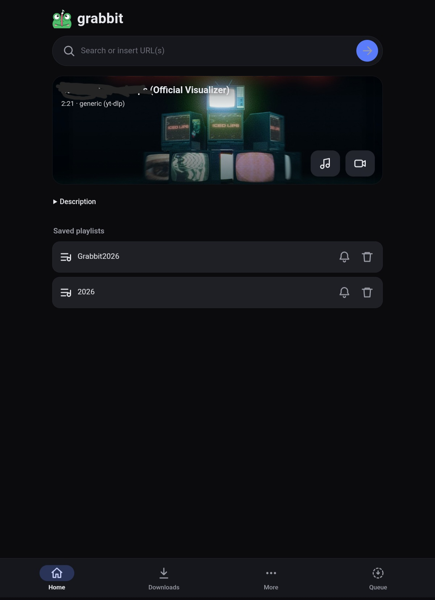
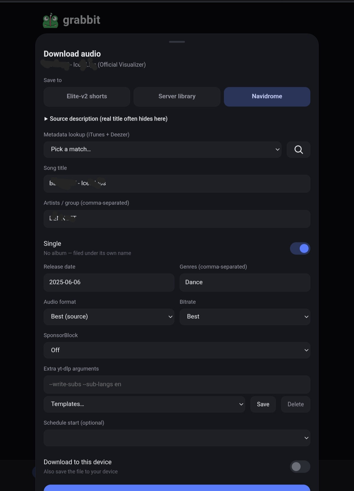
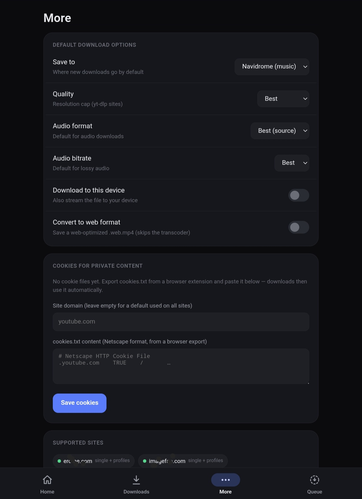
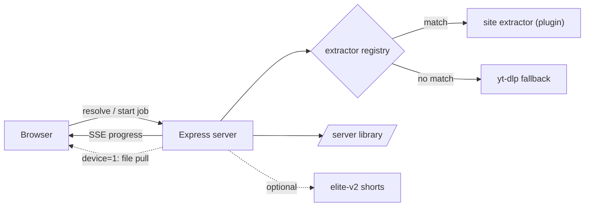

# grabbit


Plugin-based media grabber. Paste a link in the web UI; the file streams to your
device while a copy is saved on the server.

Think of it as a self-hosted download manager with a phone-friendly UI: search
or paste links, pick a destination (your device, the server library, a music
library, another app), and let the server do the heavy lifting — even for
hour-long files.

- URL: whatever host you route it to (e.g. `https://grabbit.example.com`)
- Saved copies: a host folder you bind-mount to `/data` in the container
- Stack: Node + Express, yt-dlp + ffmpeg for the generic fallback

## Screenshots

| Home | Download sheet | Settings |
|------|----------------|----------|
|  |  |  |

**Just want to run it?** Jump to [Getting started](#getting-started).
**Curious how it's built?** See [How it works](#how-it-works--under-the-hood).

- [Features](#features)
- [Getting started](#getting-started)
- [How it works](#how-it-works--under-the-hood)
- [Adding a new site](#adding-a-new-site)
- [Configuration](#configuration) · [Auth](#auth)
- [Deploy](#deploy)

## Features

- **Search**: type plain words instead of a URL and the box becomes a video
  search (`yt-dlp ytsearch`); click a result to fetch it.
- **Multi-link paste**: paste several URLs at once — one card queues them all
  as separate jobs sharing the same settings.
- **Destinations**: download to your device, the server library, a music
  library (with metadata tagging via iTunes/Deezer lookup), or hand the file to
  a co-hosted app such as [elite-v2](https://github.com/tjelite1986/elite-v2).
- **Playlist watching**: save a playlist and grabbit polls it on an interval,
  fetching new entries automatically.
- **Cookies for private content**: store Netscape `cookies.txt` files under
  More → Cookies (one default file plus optional per-domain files). Every
  yt-dlp call — resolve, download, playlists — automatically uses the matching
  file, unlocking member/private/premium content. Each invocation gets its own
  throwaway temp copy so concurrent jobs can't corrupt the stored file.
- **Cutting**: give timestamp sections (`0:30-1:45, 3:10-4:00`) to download
  only those parts (`--download-sections` + `--force-keyframes-at-cuts`), or
  toggle *Split by chapters* for one file per chapter (`--split-chapters`).
  Server-library destination only, since a cut can produce several files.
- **SponsorBlock**: per download, either remove the sponsored segments or keep
  them but embed them as chapters.
- **Scheduling**: pick a start time in the sheet; the job waits as `scheduled`,
  survives restarts (persisted in `DATA_DIR/scheduled.json`) and can be
  cancelled from the queue.
- **Extra yt-dlp arguments**: a flags field in the sheet, with named templates
  you can save/re-use. Only an allowlisted safe subset of long yt-dlp options
  passes through (subtitles, format selection, network pacing, site auth,
  SponsorBlock categories, …) — short flags, unknown flags and stray
  positional tokens are refused, so nothing can execute programs, touch
  arbitrary paths or smuggle extra URLs.
- **Retry & re-download**: failed/cancelled jobs get a retry button in the
  queue; history rows get a re-download button.

## Getting started

Run it on your own machine, step by step. No prior experience needed.

**Before you start**, install these free tools (skip any you already have):

- **Node.js 20 (LTS)** — from [nodejs.org](https://nodejs.org). Check with
  `node --version`.
- **yt-dlp** — the downloader that handles ~1750 sites. Install per the
  [official instructions](https://github.com/yt-dlp/yt-dlp/wiki/Installation)
  (e.g. `pipx install yt-dlp` or a release binary on your `PATH`). Check with
  `yt-dlp --version`.
- **ffmpeg** — merges/cuts media. `sudo apt install ffmpeg` on Debian/Ubuntu,
  `brew install ffmpeg` on macOS. Check with `ffmpeg -version`.

Then, in a terminal:

**Step 1 — Download the code:**

```bash
git clone https://github.com/tjelite1986/grabbit.git
cd grabbit
```

**Step 2 — Install dependencies:**

```bash
npm install
```

(It's quick — the server itself only depends on Express; everything heavy is
done by yt-dlp/ffmpeg.)

**Step 3 — Start it:**

```bash
npm start
```

Open **http://localhost:3000**, paste a video link, press the arrow. That's it —
no config file is required for a local try-out. Files land in the download
folder (see [Configuration](#configuration) to choose where), and jobs/cookies
state lives in `DATA_DIR`.

To stop the server, press `Ctrl + C`. For running it permanently on a server,
see [Deploy](#deploy).

## How it works — under the hood



1. `GET /api/resolve?url=...` picks the matching extractor and returns metadata
   (incl. `duration` and `tooLongForShorts`).
2. The web UI starts a **background job** (`GET /api/jobs/start?...`) and watches
   progress over SSE (`GET /api/jobs/stream`). The download runs server-side, so a
   long file no longer has to finish within the gateway timeout. When a job is
   done and `device=1`, the browser pulls the finished file from
   `GET /api/jobs/:id/file` (the file is already on disk, so bytes flow at once).
3. `GET /api/download?url=...` (synchronous, returns JSON or streams the file) and
   `GET /api/download-all` (SSE batch) are kept for elite-v2's internal grab
   integration, which calls grabbit over the docker network (no gateway timeout).

Any URL no dedicated extractor claims falls back to yt-dlp automatically.

A few design choices worth knowing about:

- **Plugins over a monolith.** Each supported site is one file in
  `extractors/` exporting `match()` + `resolve()`; the registry auto-loads
  them. The generic yt-dlp extractor is just the plugin that matches last.
- **Jobs, not requests.** Downloads never run inside the HTTP request that
  started them. A job survives the browser tab closing, reports progress over
  SSE, persists scheduled runs to disk, and can be retried from the queue.
- **Shell-injection paranoia.** User-supplied yt-dlp flags pass through an
  allowlist of known-safe long options; everything else — short flags, unknown
  options, stray positional arguments — is rejected before a process is
  spawned. External binaries are invoked with argument arrays, never via a
  shell string.
- **Cookies without corruption.** Stored `cookies.txt` files are never handed
  to yt-dlp directly; each invocation gets its own temp copy, so concurrent
  jobs can't clobber the jar (yt-dlp rewrites the file it's given).

### Long videos

Shorts are short clips, so a video longer than `SHORTS_MAX_DURATION` seconds
(default 600 = 10 min, `0` disables) is refused for the elite-v2 shorts
destination and routed to the plain server library instead. The web UI forces
the server library and shows a notice; the elite path and the batch downloader
skip known-long clips.

## Adding a new site

Drop a file in `extractors/` that exports:

```js
module.exports = {
  name: 'example',
  match(url) { return new URL(url).hostname.endsWith('example.com'); },
  async resolve(url) {
    return {
      kind: 'direct',                 // or 'ytdlp'
      filename: 'creator-id.mp4',
      title: '...',
      thumbnail: '...',
      downloadUrl: 'https://cdn.example.com/real.mp4',
      headers: { Referer: 'https://example.com/' }, // headers the CDN requires
    };
  },
};
```

See `extractors/nuditok.js` for a real example (SPA whose real URL only comes
from a private API). The registry in `extractors/index.js` auto-loads every file
except `index.js` and `generic.js`.

## Configuration

Everything is optional — grabbit starts with sensible defaults. Set via
environment variables:

### Server

| Variable | Description |
| -------- | ----------- |
| `PORT` | Listen port (default `3000`). |
| `DATA_DIR` | State directory: job history, `scheduled.json`, cookie files. |
| `MAX_ACTIVE_JOBS` | Max downloads running concurrently (default `2`). |
| `WATCH_INTERVAL_MINUTES` | How often watched playlists are polled. |

### Destinations

| Variable | Description |
| -------- | ----------- |
| `DOWNLOAD_DIR` | Server-library root for saved copies. |
| `VIDEOS_DOWNLOAD_DIR` / `AUDIO_DOWNLOAD_DIR` / `PHOTOS_DOWNLOAD_DIR` / `ADULTS_DOWNLOAD_DIR` | Per-type overrides inside the library. |
| `NAVIDROME_MUSIC_DIR` | Music-library destination (tagged audio, e.g. for Navidrome). |
| `ELITE_ROOT` | elite-v2 shorts storage root — enables the elite destination. |
| `SHORTS_MAX_DURATION` | Max clip length (seconds) for the shorts destination; `0` disables the check. |

### External tools

| Variable | Description |
| -------- | ----------- |
| `YTDLP_BIN` / `FFMPEG_BIN` / `FFPROBE_BIN` / `GALLERY_DL_BIN` / `PYTHON_BIN` | Paths to the external binaries, when they're not on `PATH`. |

### Auth

| Variable | Description |
| -------- | ----------- |
| `GRABBIT_PASSWORD` | Shared password gating the web UI (auth off when unset). |
| `GRABBIT_SECRET` | Optional separate secret for signing the auth cookie. |
| `GRABBIT_INTERNAL_TOKEN` | Token internal (co-hosted) callers must send in `X-Grabbit-Token`. |

## Auth

Set `GRABBIT_PASSWORD` to gate the web UI behind a single shared password
(HMAC-signed cookie; `GRABBIT_SECRET` optionally signs it separately). Only
external traffic — requests carrying an `X-Forwarded-Host` header from the
reverse proxy — is gated, so a co-hosted app can call the API directly over the
docker network. Because header absence alone doesn't identify the caller, set
`GRABBIT_INTERNAL_TOKEN` to require internal callers to also send the value in
an `X-Grabbit-Token` header; when unset, any header-less request counts as
internal. With no `GRABBIT_PASSWORD` at all, auth is off entirely.

## Deploy

Keep a compose directory for the stack (e.g. `compose/grabbit/`).

```bash
cd /path/to/compose/grabbit
docker compose build && docker compose up -d
```

Rebuild is only needed when `package.json` or the Dockerfile changes; for plain
code edits the same applies because the source is copied into the image (no bind
mount), so always `docker compose build && up -d` after editing extractors.
