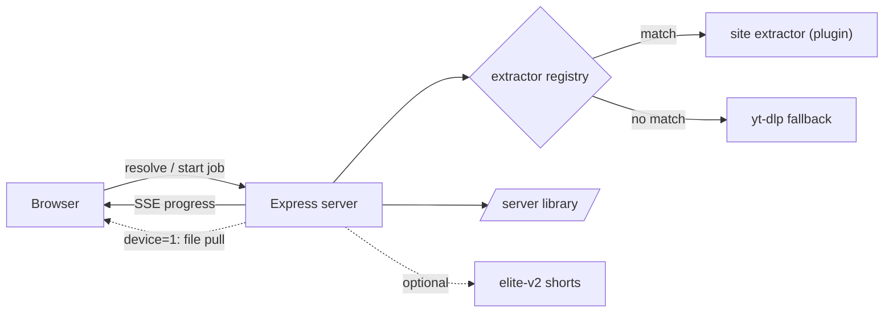

# grabbit


Plugin-based media grabber. Paste a link in the web UI; the file streams to your
device while a copy is saved on the server.

Think of it as a self-hosted download manager with a phone-friendly UI: search
or paste links, pick a destination (your device, the server library, a music
library, another app), and let the server do the heavy lifting — even for
hour-long files.

- URL: whatever host you route it to (e.g. `https://grabbit.example.com`)
- Saved copies: a host folder you bind-mount to `/data` in the container
- Stack: Node + Express, yt-dlp + ffmpeg for the generic fallback
- Supported sites: everything yt-dlp handles (~1750 sites), plus a handful of
  dedicated extractors for sites yt-dlp doesn't cover well — so the reach is the
  same as metube/yt-dlp and then some

## Screenshots

| Home | Download sheet | Settings |
|------|----------------|----------|
|  |  |  |

**Just want to run it?** Jump to [Getting started](#getting-started).
**Curious how it's built?** See [How it works](#how-it-works--under-the-hood).

- [Features](#features)
- [Getting started](#getting-started)
- [Everyday use](#everyday-use)
- [How it works](#how-it-works--under-the-hood)
- [Adding a new site](#adding-a-new-site)
- [Configuration](#configuration) · [Auth](#auth)
- [Deploy](#deploy)

## Features

- **Search**: type plain words instead of a URL and the box becomes a video
  search (`yt-dlp ytsearch`); click a result to fetch it.
- **Multi-link paste**: paste several URLs at once — one card queues them all
  as separate jobs sharing the same settings. Links may be separated by spaces
  or newlines, or run straight together with no separator at all
  (`https://a/x/https://b/y`), which is far easier to assemble on a phone or
  tablet.
- **Destinations**: download to your device, the server library, a music
  library (with metadata tagging via iTunes/Deezer lookup), or hand the file to
  a co-hosted app such as [elite-v2](https://github.com/tjelite1986/elite-v2).
- **Playlist watching**: save a playlist and grabbit polls it on an interval,
  fetching new entries automatically.
- **Cookies for private content**: store Netscape `cookies.txt` files under
  More → Cookies (one default file plus optional per-domain files). Every
  yt-dlp call — resolve, download, playlists — automatically uses the matching
  file, unlocking member/private/premium content. Each invocation gets its own
  throwaway temp copy so concurrent jobs can't corrupt the stored file.
- **Cutting**: give timestamp sections (`0:30-1:45, 3:10-4:00`) to download
  only those parts (`--download-sections` + `--force-keyframes-at-cuts`), or
  toggle *Split by chapters* for one file per chapter (`--split-chapters`).
  Server-library destination only, since a cut can produce several files.
- **SponsorBlock**: per download, either remove the sponsored segments or keep
  them but embed them as chapters.
- **Scheduling**: pick a start time in the sheet; the job waits as `scheduled`,
  survives restarts (persisted in `DATA_DIR/scheduled.json`) and can be
  cancelled from the queue.
- **Extra yt-dlp arguments**: a flags field in the sheet, with named templates
  you can save/re-use. Only an allowlisted safe subset of long yt-dlp options
  passes through (subtitles, format selection, network pacing, site auth,
  SponsorBlock categories, …) — short flags, unknown flags and stray
  positional tokens are refused, so nothing can execute programs, touch
  arbitrary paths or smuggle extra URLs.
- **Retry & re-download**: failed/cancelled jobs get a retry button in the
  queue; history rows get a re-download button.

## Getting started

Run it on your own machine, step by step. No prior experience needed.

**Before you start**, install these free tools (skip any you already have):

- **Node.js 20 (LTS)** — from [nodejs.org](https://nodejs.org). Check with
  `node --version`.
- **yt-dlp** — the downloader that handles ~1750 sites. Install per the
  [official instructions](https://github.com/yt-dlp/yt-dlp/wiki/Installation)
  (e.g. `pipx install yt-dlp` or a release binary on your `PATH`). Check with
  `yt-dlp --version`.
- **ffmpeg** — merges/cuts media. `sudo apt install ffmpeg` on Debian/Ubuntu,
  `brew install ffmpeg` on macOS. Check with `ffmpeg -version`.

Then, in a terminal:

**Step 1 — Download the code:**

```bash
git clone https://github.com/tjelite1986/grabbit.git
cd grabbit
```

**Step 2 — Install dependencies:**

```bash
npm install
```

(It's quick — the server itself only depends on Express; everything heavy is
done by yt-dlp/ffmpeg.)

**Step 3 — Start it:**

```bash
npm start
```

Open **http://localhost:3000**, paste a video link, press the arrow. That's it —
no config file is required for a local try-out. Files land in the download
folder (see [Configuration](#configuration) to choose where), and jobs/cookies
state lives in `DATA_DIR`.

To stop the server, press `Ctrl + C`. For running it permanently on a server,
see [Deploy](#deploy).

## Everyday use

A few things the web UI does that aren't obvious at first glance.

**Paste one link — or many.** One link resolves to a single card. Paste several
and grabbit lays them out as a batch, queuing every one with the same settings.
The links can be on separate lines, spaced out, or run straight together with no
separator:

```
https://www.example.com/share/r/19EBzS35RK/
https://www.example.com/share/r/19EBzS35RK/
https://www.example.com/share/r/19EBzS35RK/
```

```
https://www.example.com/share/r/19EBzS35RK/https://www.example.com/share/r/19EBzS35RK/https://www.example.com/share/r/19EBzS35RK/
```

The second form takes no spacing to get right, which makes it much easier to
build up a list on a phone or tablet.

**Download straight into a music server.** If you run your own music server such
as [Navidrome](https://www.navidrome.org/), point the music destination at its
library folder and grabbit files each track into a clean, scannable tree:

```
[Artist]/[Album (Year)]/[Artist] - [Album (Year)] - [Title].ext
```

(Artist and album repeat in the file name on purpose, so a track stays
identifiable even if it ends up outside its folder.)

**Auto or hand-picked metadata.** Leave tagging on **auto** and grabbit names
and tags the track for you. Prefer to curate it? Do it manually and pick the
right match from a metadata lookup list — set the genre, mark it as part of an
Album, Single or EP, and check the source description, where the real title is
often hiding.

### Playlists, subscriptions and bulk downloads

Paste a **playlist** or a **creator/profile** link and grabbit doesn't resolve a
single file — it lists *every* item in it as a card, with batch actions on top.
This is how you grab a whole channel, playlist or profile at once.

**The item list.** The header shows the playlist/profile name, the handle and how
many items it holds. Each card has:

- an **audio** button and a **video** button (image items get an **image**
  button instead) — tap either to open the download sheet for just that one item;
- a **✓ mark-as-downloaded** toggle. grabbit remembers what you've already
  grabbed so you can tell new from old at a glance; tap again to clear the mark.

**Batch actions across the whole list:**

- **Download all** (the floating button, bottom-right) — opens the download sheet
  once for *every* item in the list. Whatever you set there is shared by all of
  them, and each file still names and tags itself from its own metadata (so the
  per-item title/tag fields are hidden in a batch).
- **Download new to Navidrome (N)** — queues every item you *haven't* downloaded
  yet as tagged audio into your music library, skipping the ones already done.
  Disabled when there's nothing new. `(N)` is how many are fresh.
- **Hide downloaded (N) / Show all** — collapse the items you've already grabbed
  so only new ones show. The choice is remembered between visits.

**"Download all as audio" vs "Download all as video".** When you paste several
links at once you get both buttons, and the difference is exactly what it says:

- **Download all as audio** — extracts *only the sound track* of each link. Use
  this for music, podcasts or anything you only want to listen to: the files are
  much smaller, and the sheet gives you the audio-specific options (audio format
  + bitrate). Each track is named and tagged from its own metadata.
- **Download all as video** — downloads the *full video* (picture + sound) of
  each link, at the quality and container you choose in the sheet.

Both open the same shared-settings sheet; the only difference is whether you end
up with audio files or video files. (Sending a batch to the **Navidrome** music
destination always extracts audio, whichever button you started from — a music
library holds songs, not video.)

**Subscribing to a playlist.** In a playlist view, tap **Save playlist** (it
becomes **Remove saved playlist** once saved). Saved playlists live under
**More → Saved playlists**, where each row gives you:

- **Tap the row** — re-open the playlist to look through it and check for new
  items by hand.
- **The library pill (`Mine` / `Kids`)** — tap to switch which Navidrome library
  this playlist's new tracks go into (your own or the separate kids library).
- **The bell (watch) toggle** — turn on **auto-download**: grabbit then polls the
  playlist on an interval (`WATCH_INTERVAL_MINUTES`) and downloads any newly
  added track to Navidrome on its own, as tagged audio — no need to come back.
  Off means the playlist is just saved for easy re-opening, nothing downloads by
  itself.
- **The trash icon** — remove the saved playlist (this only unsubscribes; it
  never touches files you've already downloaded).

### Default download options — every setting explained

These live under **More → Default download options**. They set the *starting
point* for every new download: the options sheet opens pre-filled with them, you
can still change anything per download, and a matching [rule](#rules--automate-the-settings-youd-otherwise-pick-every-time)
can override them. Each change saves the instant you make it — there's no separate
save button.

Some rows only appear when they're relevant (e.g. the music-library picker shows
up only once the destination is Navidrome); that's noted per setting.

- **Save to** — the destination new downloads go to. This choice also decides
  which of the rows below are shown.
  - *Elite-v2 shorts* — the short-clip library of the co-hosted elite-v2 app.
  - *Server library* — a plain folder library on the server.
  - *Navidrome (music)* — a tagged music library: audio only, filed by
    artist/album (see the naming scheme above).

- **Music library** — *shown only when Save to = Navidrome.* Which music library
  the audio lands in: *My music* or *Kids* (a separate library/instance).

- **Channel** — *shown only when Save to = Elite-v2 shorts.* Which shorts channel
  new clips post to: *main* or *18+*.

- **Library folder** — *shown only when Save to = Server library.* The subfolder
  inside the server library that video downloads are filed under.

- **Quality** — the resolution **cap** for downloads from yt-dlp sites. *Best*
  takes the highest available; pick a number (2160p/4K down to 360p) to cap it
  there — handy to save space or bandwidth. Sites with a dedicated extractor
  hand over their own single quality, so this only affects yt-dlp links.

- **Video container** — *shown only when Save to = Server library.* The file
  format video is saved as: *mp4* (most compatible), *mkv* or *webm*. mkv and
  webm need a yt-dlp remux, so they apply to yt-dlp downloads.

- **Audio format** — the format for audio-only downloads. *Best (source)* keeps
  the original track without re-encoding (fastest, no quality loss); the others
  force a format — lossy (*mp3*, *opus*, *aac*, *vorbis*, *m4a*) or lossless
  (*flac*, *wav*, *alac*).

- **Audio bitrate** — the target bitrate for **lossy** audio only; it has no
  effect on lossless formats or on *Best (source)*. *Best* lets yt-dlp decide;
  otherwise pick from 320k (highest quality, biggest file) down to 96k
  (smallest).

- **Download to this device** — *on by default.* When on, the finished file is
  also streamed to the device you're using, on top of the server copy. Turn it
  off to keep the file only on the server and skip pulling it to your phone/PC.

- **Convert to web format** — save the download already as a web-optimized
  `.web.mp4`, ready to play in a browser without a later transcode pass (it skips
  the separate transcoder step).

- **Notify when done** — *shown only after you've enabled push notifications.*
  Sends a push notification when a download finishes.

### The download sheet — every field explained

When you tap a download action on a resolved link (audio / video / image), or a
batch button on a playlist/multi-paste, the **options sheet** slides up. It's
pre-filled from your [default download options](#default-download-options--every-setting-explained);
anything you change here applies to **this download only**. The button at the
bottom starts it.

The sheet is context-aware: it only shows the fields that make sense for what
you're downloading and where it's going, so you'll never see all of these at
once. Each entry below says when it appears.

**Naming and tagging**

- **Title** — the file/clip title. *Shown for a single link or one item picked
  from a profile; hidden for Navidrome and for batch/multi runs* (there each item
  keeps its own title).
- **Save under profile name** — files the download under a creator/profile name.
  *Hidden for Navidrome and multi-link runs.*
- **Hashtags (space or comma separated)** — tags that feed the clip's
  caption/keywords. *Hidden for Navidrome (which uses genres instead) and for
  batch runs.*

**Where it goes**

- **Save to** — the destination for this download: *Elite-v2 shorts*, *Server
  library* or *Navidrome*. This choice drives which fields below appear.
- **Music library** — *Navidrome only.* *My music* or *Kids*.
- **Channel** — *Elite-v2 shorts only.* *main* or *18+*.
- **Library folder** — *server-library video only.* Pick an existing subfolder,
  or choose *New folder* to reveal…
- **New folder name** — *shown when Library folder = New folder.* Names the
  subfolder to create.

**Music tagging** *(the whole block shows only for a single Navidrome save — not
batches, which tag each track automatically from its own metadata)*

- **Source description** — a collapsible panel showing the original post's
  description, where the real song title often hides when the video title is
  clickbait.
- **Metadata lookup (iTunes + Deezer)** — a dropdown of matches from a music
  database; picking one fills every tag field below at once. The button beside it
  re-runs the search.
- **Song title** — the track title tag.
- **Artists / group (comma-separated)** — one or more artists.
- **Release type** — *Album*, *Single* or *EP*. A *Single* has no album and is
  filed under its own name (the album field disappears); *EP* relabels the field
  to *EP name*.
- **Album / EP name** — *hidden for Single.* The album/EP the track belongs to.
- **Release date** — `YYYY` or `YYYY-MM-DD`; the year becomes the `(Year)` in the
  folder path.
- **Genres (comma-separated)** — one or more genre tags.

**Quality and format**

- **Quality** — resolution cap for yt-dlp sites (*Best* or 2160p…360p). *Shown
  for video, non-Navidrome.*
- **Container** — output format *mp4 / mkv / webm*. *Server-library video only*
  (Elite shorts stay plain mp4; mkv/webm need yt-dlp).
- **Audio format** + **Bitrate** — same choices as the defaults; bitrate applies
  to lossy formats only. *Shown for audio downloads* (including a Navidrome save,
  which always extracts audio).

**Video extras** *(server-library video only)*

- **Embed thumbnail** — write the cover art inside the file.
- **Embed subtitles** — include subtitles when the source has them.

**SponsorBlock** — *shown for server-library video or any audio extraction.*
*Off*, *Remove segments* (cut sponsor/intro/etc. out) or *Keep, mark as chapters*
(leave them in but add chapter markers).

**Cutting** *(server library, not images, not batches)*

- **Cut sections (start-end, comma-separated)** — download only the given
  timestamp ranges, e.g. `0:30-1:45, 3:10-4:00`. Because a cut can produce
  several files, it's server-library only.
- **Split by chapters** — *video only.* Save one file per chapter instead.

**Advanced and delivery**

- **Extra yt-dlp arguments** — pass extra flags straight to yt-dlp, e.g.
  `--write-subs --sub-langs en`. Only an allowlisted safe subset of long options
  is accepted; you can save named **Templates** (Save/Delete) to reuse a flag set.
  *Shown for anything except images; ignored by sites with a direct extractor.*
- **Schedule start (optional)** — a date/time to hold the job until; it waits as
  *scheduled*, survives restarts, and can be cancelled from the queue. *Hidden for
  the download-all batch.*
- **Convert to web format** — save a web-ready `.web.mp4` immediately, skipping
  the later transcoder pass. *Elite-v2 video saves only.*
- **Download to this device** — *on by default.* Also stream the finished file to
  your device, not just the server. *Hidden for the download-all batch.*

**The confirm button** relabels itself for the context — *Download & import*,
*Save to library*, *Save to Navidrome*, *Download all (N)*, and so on — so it
always says exactly what pressing it will do. A **warning banner** may appear
above the fields when something's worth knowing before you commit: the clip is
too long for shorts (so it's routed to the server library instead), or it's
already been downloaded/imported.

### Rules — automate the settings you'd otherwise pick every time

Under **More → Rules** you can teach grabbit to fill in the download options for
you whenever a link matches. Each rule is a simple *when this → then that*: a set
of match conditions and the settings to apply when they're met.

**How matching works:**

- A rule has a **When** block (the conditions) and a **Then** block (the settings
  to apply). Leave every When field empty and the rule matches *everything*.
- All the conditions you do fill in must match (they're AND-ed together).
- Matching is **case-insensitive substring** by default — `youtube` matches
  `www.youtube.com`. Wrap a pattern in `/slashes/` to use a **regex** instead,
  e.g. `/(mp3|flac)$/` on the title.
- Rules are checked **top to bottom, and the first enabled match wins**, so put
  your most specific rules above the broad catch-all ones. Drag to reorder.

**What you can match on (When):** site, creator, title contains (text or
`/regex/`), media type (video/image), and a duration range in seconds (only
applies to links whose length is known).

**What you can set (Then):** destination (Elite-v2 shorts / server library /
Navidrome music), channel (main / 18+), music library (mine / kids), a library
subfolder, quality, audio format + bitrate, video container, SponsorBlock
(remove or mark), save-to-this-device, a profile name to file it under, and an
*extract audio only* toggle. Anything left on **Don't change** keeps the normal
default. A rule only touches the fields you actually set.

**Automatic rules.** Flip **Fully automatic** on and a matching *shared* link
starts downloading immediately with the rule's settings — the options sheet
never opens. Leave it off and the rule just pre-fills the sheet, so you still get
a chance to review before hitting download.

**Examples:**

- *Send music straight to Navidrome.* When **Site** = `youtube` → Then
  **Extract audio only** on, **Audio format** = `opus`, **Save to** =
  `Navidrome (music)`, and **Fully automatic** on. Now sharing a YouTube link
  files a tagged track into your music library with zero taps.
- *Keep long videos out of shorts.* When **Type** = `Video`, **Duration min** =
  `1200` → Then **Save to** = `Server library`, **Quality** = `1080p`.
- *Route one creator to the 18+ channel.* When **Creator** = `somename` → Then
  **Channel** = `18+`. Put this above any broader site rule so it wins.

### Unlocking private or login-only content with cookies

Some links only resolve when you're signed in — members-only videos, private
playlists, age-gated pages, premium audio. grabbit can borrow your browser's
login by using an exported `cookies.txt` file. Every yt-dlp call — resolve,
download and playlist polling — then reuses it automatically, so login-gated
content just works.

**Getting a `cookies.txt` file.** It has to be in the classic *Netscape* format,
which a small browser extension produces in one click:

1. Sign in to the site in your browser as usual.
2. Install a "cookies.txt" exporter extension — for example *Get cookies.txt
   LOCALLY* (Chrome/Edge) or *cookies.txt* (Firefox). Pick one that exports the
   **Netscape** format and keeps the data on your machine.
3. Open the site and click the extension. You don't have to download a file —
   *Get cookies.txt LOCALLY* has a **Copy** button that puts the cookies on your
   clipboard, ready to paste straight into grabbit.

**On a phone or tablet.** Most mobile browsers can't run extensions, but
[Ultimatum](https://github.com/gonzazoid/Ultimatum) (Android) can. Download the
*Get cookies.txt LOCALLY* plugin and load it into Ultimatum, then sign in to the
site, tap the extension's **Copy** button, and paste — no cookies file to save,
no desktop needed.

**Adding them to grabbit.** Go to **More → Cookies** (the *Cookies for private
content* panel) and fill in the two fields:

1. **Site domain** — type the site the cookies are for, e.g. `example.com`.
   Leave it empty instead to save a *default* file that's used on every site.
2. **cookies.txt content (Netscape format, from a browser export)** — paste the
   text you copied with the extension's **Copy** button.
3. Click **Save cookies**.

That's it — the file appears in the list above the form, and matching downloads
start using it right away. You can keep one default plus any number of per-domain
files side by side; grabbit picks the matching one for each download on its own,
and each saved file has a delete button when you want to remove it.

A couple of things worth knowing:

- **Use a throwaway account** where you can. Cookies are live login sessions —
  treat the file like a password, and don't hand a site your main account if a
  spare will do.
- Cookies expire. If a previously working link starts failing on login again,
  re-export and paste a fresh file.
- Stored files are never touched in place — each download gets its own temp
  copy, so running several jobs at once can't corrupt the saved cookies.

## How it works — under the hood



1. `GET /api/resolve?url=...` picks the matching extractor and returns metadata
   (incl. `duration` and `tooLongForShorts`).
2. The web UI starts a **background job** (`GET /api/jobs/start?...`) and watches
   progress over SSE (`GET /api/jobs/stream`). The download runs server-side, so a
   long file no longer has to finish within the gateway timeout. When a job is
   done and `device=1`, the browser pulls the finished file from
   `GET /api/jobs/:id/file` (the file is already on disk, so bytes flow at once).
3. `GET /api/download?url=...` (synchronous, returns JSON or streams the file) and
   `GET /api/download-all` (SSE batch) are kept for elite-v2's internal grab
   integration, which calls grabbit over the docker network (no gateway timeout).

Any URL no dedicated extractor claims falls back to yt-dlp automatically.

A few design choices worth knowing about:

- **Plugins over a monolith.** Each supported site is one file in
  `extractors/` exporting `match()` + `resolve()`; the registry auto-loads
  them. The generic yt-dlp extractor is just the plugin that matches last.
- **Jobs, not requests.** Downloads never run inside the HTTP request that
  started them. A job survives the browser tab closing, reports progress over
  SSE, persists scheduled runs to disk, and can be retried from the queue.
- **Shell-injection paranoia.** User-supplied yt-dlp flags pass through an
  allowlist of known-safe long options; everything else — short flags, unknown
  options, stray positional arguments — is rejected before a process is
  spawned. External binaries are invoked with argument arrays, never via a
  shell string.
- **Cookies without corruption.** Stored `cookies.txt` files are never handed
  to yt-dlp directly; each invocation gets its own temp copy, so concurrent
  jobs can't clobber the jar (yt-dlp rewrites the file it's given).

### Long videos

Shorts are short clips, so a video longer than `SHORTS_MAX_DURATION` seconds
(default 600 = 10 min, `0` disables) is refused for the elite-v2 shorts
destination and routed to the plain server library instead. The web UI forces
the server library and shows a notice; the elite path and the batch downloader
skip known-long clips.

## Adding a new site

Drop a file in `extractors/` that exports:

```js
module.exports = {
  name: 'example',
  match(url) { return new URL(url).hostname.endsWith('example.com'); },
  async resolve(url) {
    return {
      kind: 'direct',                 // or 'ytdlp'
      filename: 'creator-id.mp4',
      title: '...',
      thumbnail: '...',
      downloadUrl: 'https://cdn.example.com/real.mp4',
      headers: { Referer: 'https://example.com/' }, // headers the CDN requires
    };
  },
};
```

See `extractors/nuditok.js` for a real example (SPA whose real URL only comes
from a private API). The registry in `extractors/index.js` auto-loads every file
except `index.js` and `generic.js`.

## Configuration

Everything is optional — grabbit starts with sensible defaults. Set via
environment variables:

### Server

| Variable | Description |
| -------- | ----------- |
| `PORT` | Listen port (default `3000`). |
| `DATA_DIR` | State directory: job history, `scheduled.json`, cookie files. |
| `MAX_ACTIVE_JOBS` | Max downloads running concurrently (default `2`). |
| `WATCH_INTERVAL_MINUTES` | How often watched playlists are polled. |

### Destinations

| Variable | Description |
| -------- | ----------- |
| `DOWNLOAD_DIR` | Server-library root for saved copies. |
| `VIDEOS_DOWNLOAD_DIR` / `AUDIO_DOWNLOAD_DIR` / `PHOTOS_DOWNLOAD_DIR` / `ADULTS_DOWNLOAD_DIR` | Per-type overrides inside the library. |
| `NAVIDROME_MUSIC_DIR` | Music-library destination (tagged audio, e.g. for Navidrome). |
| `ELITE_ROOT` | elite-v2 shorts storage root — enables the elite destination. |
| `SHORTS_MAX_DURATION` | Max clip length (seconds) for the shorts destination; `0` disables the check. |

### External tools

| Variable | Description |
| -------- | ----------- |
| `YTDLP_BIN` / `FFMPEG_BIN` / `FFPROBE_BIN` / `GALLERY_DL_BIN` / `PYTHON_BIN` | Paths to the external binaries, when they're not on `PATH`. |

### Auth

| Variable | Description |
| -------- | ----------- |
| `GRABBIT_PASSWORD` | Shared password gating the web UI (auth off when unset). |
| `GRABBIT_SECRET` | Optional separate secret for signing the auth cookie. |
| `GRABBIT_INTERNAL_TOKEN` | Token internal (co-hosted) callers must send in `X-Grabbit-Token`. |

## Auth

Set `GRABBIT_PASSWORD` to gate the web UI behind a single shared password
(HMAC-signed cookie; `GRABBIT_SECRET` optionally signs it separately). Only
external traffic — requests carrying an `X-Forwarded-Host` header from the
reverse proxy — is gated, so a co-hosted app can call the API directly over the
docker network. Because header absence alone doesn't identify the caller, set
`GRABBIT_INTERNAL_TOKEN` to require internal callers to also send the value in
an `X-Grabbit-Token` header; when unset, any header-less request counts as
internal. With no `GRABBIT_PASSWORD` at all, auth is off entirely.

## Deploy

Keep a compose directory for the stack (e.g. `compose/grabbit/`).

```bash
cd /path/to/compose/grabbit
docker compose build && docker compose up -d
```

Rebuild is only needed when `package.json` or the Dockerfile changes; for plain
code edits the same applies because the source is copied into the image (no bind
mount), so always `docker compose build && up -d` after editing extractors.
